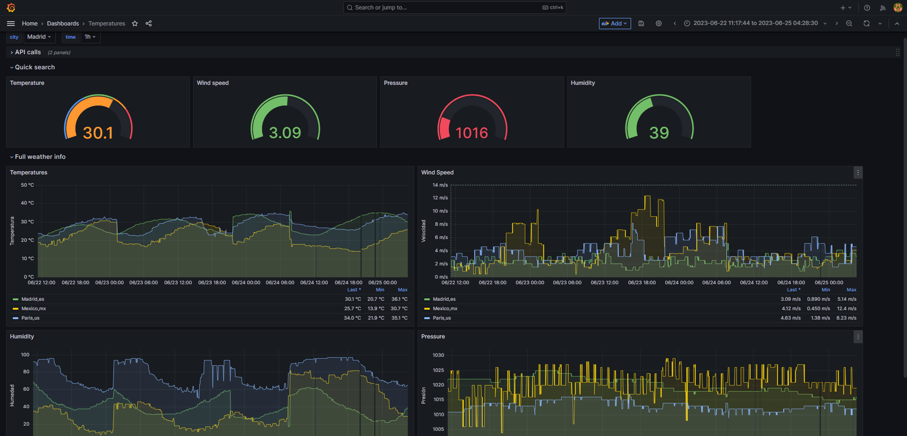

# Getting started with Prometheus and Grafana

Este repositorio proporciona un ejemplo detallado de cómo comenzar con Prometheus y Grafana para recopilar y visualizar datos utilizando la API de OpenWeather. El objetivo es mostrar cómo configurar un entorno básico y realizar la recopilación automática de datos meteorológicos de diferentes ciudades utilizando Python y Prometheus, y luego visualizar estos datos en un dashboard personalizado utilizando Grafana.

# Indice

 1. [Ejecución del Repositorio](#id0)
 2. [Prometheus](#id1)
 3. [Grafana](#id2)
 4. [Configuración](#id3)
 5. [Servicio de Recolección de Datos](#id4)
 6. [Anexo - Introducción a OpenWeather y creación de una API](#id5)

# Ejecución del Repositorio <a name=id0></a>

Para ejecutar este repositorio en un entorno Linux, sigue los siguientes pasos:

1. Asegúrate de tener instalado Python 3.8 y pip en tu sistema.

2. Clona el repositorio en tu máquina local:

   ```bash
   git clone <URL_DEL_REPOSITORIO>
   ```

3. Navega hasta el directorio del repositorio clonado:

   ```bash
   cd <NOMBRE_DEL_REPOSITORIO>
   ```

4. Crea y activa un entorno virtual para aislar las dependencias del proyecto:

   ```bash
   python3 -m venv venv
   source venv/bin/activate
   ```

5. Instala las dependencias del proyecto:

   ```bash
   pip install -r requirements.txt
   ```

6. Crea un enlace simbólico (link simbólico) del archivo de servicio "temperaturas.service" en la carpeta "/home/systemd/system/" utilizando el siguiente comando:

   ```bash
   ln -s temperaturas.service /home/systemd/system/temperaturas.service
   ```

   Esto creará un enlace simbólico al archivo de servicio en la ubicación correcta para systemd.

7. Habilita y activa el servicio usando systemctl:

   ```bash
   sudo systemctl enable temperaturas.service
   sudo systemctl start temperaturas.service
   ```

   Esto iniciará el servicio de recolección de datos y lo configurará para que se inicie automáticamente en cada arranque del sistema.

Recuerda que estos pasos son específicos para sistemas Linux. Asegúrate de adaptarlos a tu entorno y directorios específicos en caso de que difieran.


</img> <a name=id1></a>
---

Para asegurarnos de que nuestro servicio de temperaturas sea recolectado por Prometheus, necesitamos realizar algunos ajustes en el archivo de configuración de Prometheus, llamado "prometheus.yml". A continuación se muestra cómo añadir la configuración necesaria:

```yaml
scrape_configs:
  - job_name: "prometheus"
    static_configs:
      - targets: ["localhost:9090"]

   (...)

  - job_name: "temperatures"
    static_configs:
      - targets: ["127.0.0.1:9897"]
```

En esta configuración, estamos añadiendo un nuevo trabajo llamado "temperatures". En la sección "static_configs", especificamos la dirección y el puerto en los que nuestro servicio de temperaturas está disponible. Asegúrate de reemplazar la dirección IP y el puerto con los correspondientes a tu entorno.

Al agregar esta configuración a tu archivo "prometheus.yml", Prometheus comenzará a recopilar datos de nuestro servicio de temperaturas y los incluirá en los datos que almacena y procesa.

Recuerda reiniciar el servicio de Prometheus después de realizar estos cambios para que la nueva configuración tenga efecto.

¡Ahora Prometheus estará recolectando datos de temperaturas y podrás utilizar Grafana para visualizarlos en tu dashboard personalizado!


</img> <a name=id2></a>
---

[Grafana](https://grafana.com/) es una plataforma de visualización de datos que se integra con Prometheus. Proporciona una interfaz gráfica para explorar y visualizar los datos recopilados por Prometheus.

Recomendación: Puedes utilizar Grafana para crear un dashboard personalizado en el que puedas visualizar los datos recopilados de OpenWeather. Aquí puedes se puede ver un ejemplo de cómo quedaría un dashboard con los datos recolectados. 

</img>


# Configuración <a name=id3></a>

En el archivo de configuración `temperaturas.yml`, encontrarás diferentes secciones que te permiten personalizar la recopilación y visualización de datos:

### Temperature

En esta sección, puedes especificar las ciudades de las cuales deseas obtener información de OpenWeather. Puedes agregar o quitar ciudades y especificar el país correspondiente. Por ejemplo:

```yaml
Temperature:
  - City: Madrid
    Country: es
  - City: Paris
    Country: fr
```

### Configuration

#### Web

En la sección "Web" de la configuración, puedes editar los siguientes parámetros:

- `Period`: El período de tiempo, en segundos, en el que se recopilarán los datos de OpenWeather.
- `Host`: El host en el que se expondrá la página web local para recoger los datos.
- `Port`: El puerto en el que se expondrá la página web local.
- `WRoute`: La ruta de la página web local en la que se expondrán los datos recopilados.
- `APIKey`: La clave de API de OpenWeather que se utilizará para realizar las solicitudes.

Por ejemplo:

```yaml
Web:
  Period: 20
  Host: 127.0.0.1
  Port: 9897
  WRoute: /metrics
  APIKey: aaaaaaaaaaaaaaaa0000000000000000
```

#### Logging

En la sección "Logging" de la configuración, puedes personalizar la ubicación y el formato de los archivos de registro:

- `File_name`: El nombre del archivo de registro.
- `Max_size`: El tamaño máximo, en bytes, de cada archivo de registro.
- `Backup_count`: El número de archivos de respaldo que se mantendrán.

Por ejemplo:

```yaml
Logging:
  File_name: 'app.log'
  Max_size: 11000000
  Backup_count: 3
```

# Servicio de Recolección de Datos <a name=id4></a>

El servicio de recolección de datos se encarga de obtener la información de la API de OpenWeather para las ciudades especificadas en la configuración. Los datos se almacenan en archivos de registro (logs) que se guardan en la carpeta `storage/logger/`.

Recomendación: Puedes explorar y personalizar el servicio de recolección de datos modificando el código Python proporcionado en el repositorio. Asegúrate de tener instaladas las dependencias necesarias, como las librerías requests y pyyaml.


# Anexo - Introducción a OpenWeather y creación de una API <a name=id5></a>

OpenWeather es un servicio en línea que proporciona datos meteorológicos y climáticos en tiempo real y pronósticos a nivel mundial. A través de su API, los desarrolladores pueden acceder a una amplia gama de información meteorológica, como la temperatura, la humedad, la velocidad del viento y las condiciones climáticas para cualquier ubicación geográfica.

Crear una cuenta y obtener una clave de API de OpenWeather es un proceso sencillo. A continuación, se presenta una breve guía sobre cómo comenzar:

1. Regístrate en OpenWeather: Visita el sitio web de OpenWeather (https://openweathermap.org/) y regístrate para obtener una cuenta gratuita.

2. Obtén tu clave de API: Después de registrarte, accede a tu cuenta y navega hasta la sección de API Keys (Claves de API). Allí podrás generar una nueva clave de API. Esta clave será necesaria para realizar solicitudes a la API de OpenWeather y acceder a los datos meteorológicos.

3. Familiarízate con la documentación: OpenWeather proporciona una completa documentación que describe los diversos endpoints, parámetros y formatos de respuesta disponibles en su API. Asegúrate de explorar la documentación para comprender cómo utilizar la API y aprovechar al máximo sus funcionalidades. Puedes acceder a la documentación en el siguiente enlace: [Documentación de la API de OpenWeather](https://openweathermap.org/api).

4. Realiza solicitudes a la API: Utilizando tu clave de API, podrás realizar solicitudes a la API de OpenWeather y obtener datos meteorológicos para cualquier ubicación geográfica. Puedes especificar la ubicación mediante coordenadas geográficas (latitud y longitud) o a través del nombre de una ciudad. Las respuestas de la API estarán en formato JSON, lo que facilita el procesamiento de los datos en tus aplicaciones.

Aquí tienes algunos enlaces útiles para comenzar con la API de OpenWeather:

- [Documentación de la API de OpenWeather](https://openweathermap.org/api)
- [Guía de inicio rápido de la API de OpenWeather](https://openweathermap.org/guide)
- [Referencia de endpoints de la API de OpenWeather](https://openweathermap.org/current)
- [Ejemplos de código y bibliotecas para la API de OpenWeather](https://openweathermap.org/price#data)

Explorar la documentación y los ejemplos de código te ayudará a comprender mejor cómo utilizar la API de OpenWeather y cómo integrarla en tus propios proyectos para acceder a los datos meteorológicos necesarios.

Recuerda que para acceder a ciertos conjuntos de datos o funcionalidades avanzadas, es posible que se requiera una suscripción de pago. Sin embargo, OpenWeather ofrece también una opción gratuita que proporciona acceso limitado a los datos meteorológicos básicos, que es la que usaremos en este repositorio.
